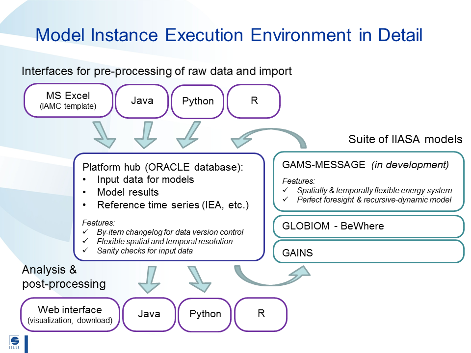

A Draft Proposal for an Integrated Modeling Framework at IIASA 
==============================================================

There is broad consensus across programs at IIASA that we should strive towards
an integrated framework for handling reference data, model input data, and model
results. This framework should follow academic best-practice, including version
control, standardized methods for read/write across standard script languages
(in particular R and Python), etc.

.. image:: _static/iam_framework-1.png

The source from which this image was created can be found at
``I:/huppmann/iiasa_IAM_modelling_platform_layout.pptx``.
